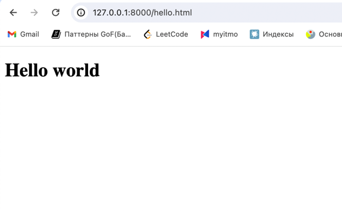

# Домашняя работа № 6 Deploy web-приложения в кластер Kubernetes

1. Создал [Dockerfile](Dockerfile). Очень много проблем получил с его запуском локально.

```shell
sudo docker build . -t ansoldatov/my-server:1.0.0 
docker run -p 8000:8000 ansoldatov/my-server:1.0.0
docker push  ansoldatov/my-server:1.0.0 
```


2.  Установил image в кластер Kubernetes в виде [Deployment](deployment.yml) c использованием livenessProbe.

```shell
kubectl apply --filename deployment.yml --namespace default 
kubectl get pods --namespace default 
```

3. Обеспечьте доступ к приложению извне кластера. Пробросил порты.

```shell
kubectl port-forward --address 0.0.0.0 deployment/web 8000:8000
```

4. [Результат команды “kubectl describe deployment web”](describe.txt)

5. Перейти по адресу http://127.0.0.1:8080/hello.html . Только, у меня был занят 8080, я пробрасывал на 8000.

